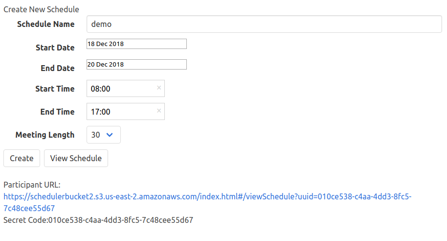
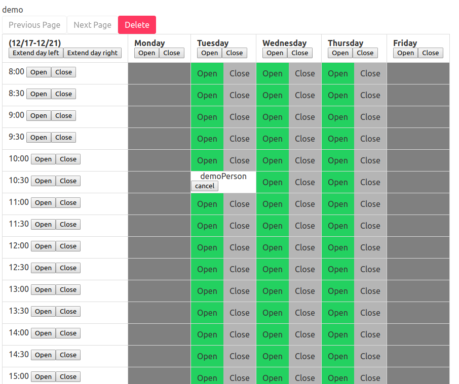
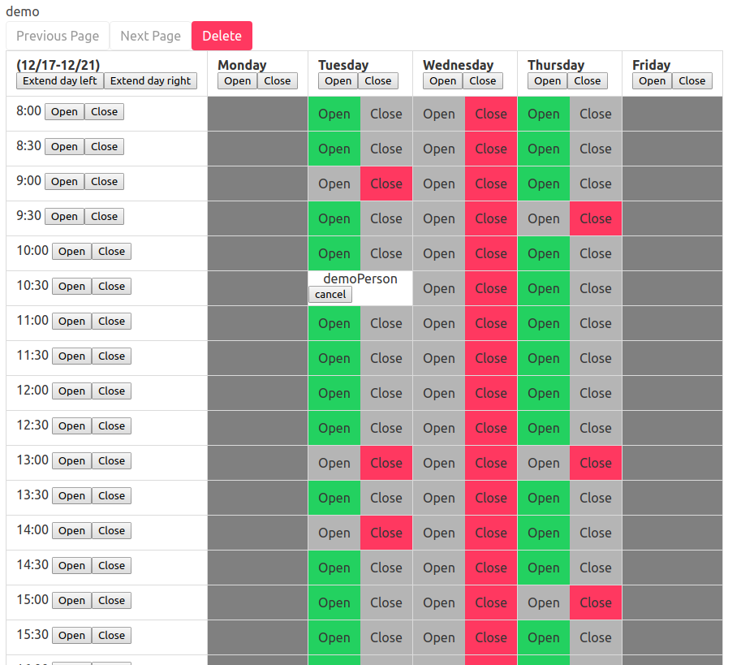
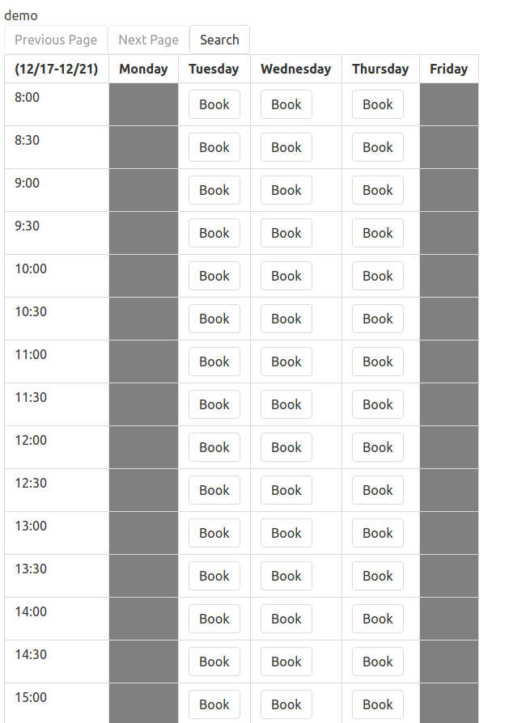
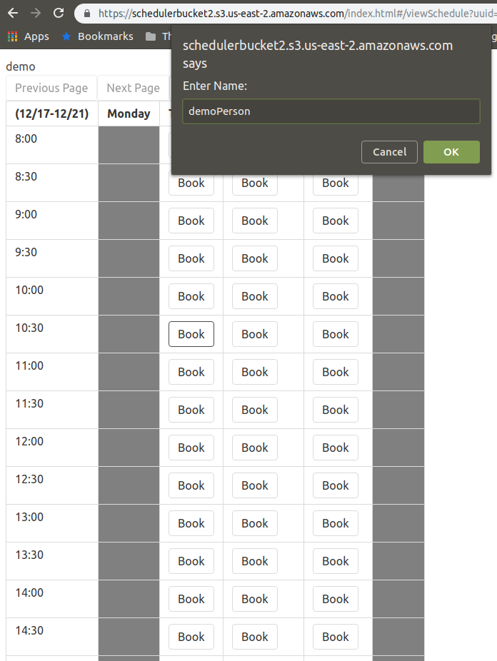
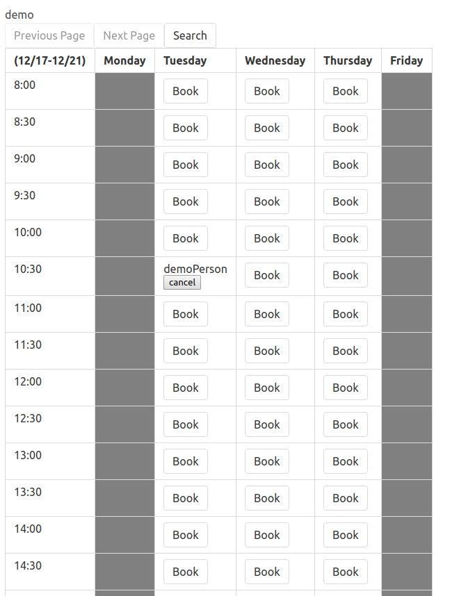
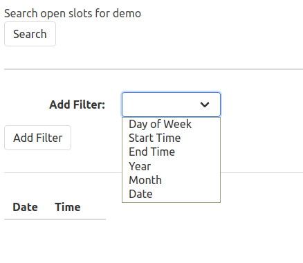
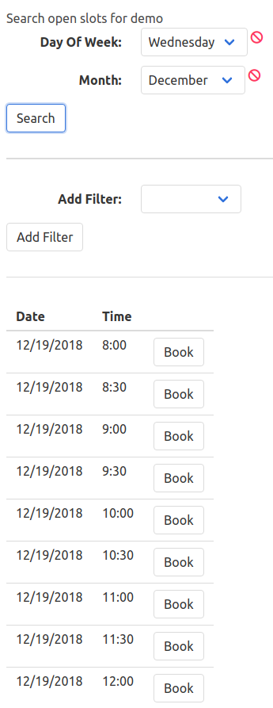

# Scheduler [Lesath Team]

This is our term project for cs3733 (Software Engineering). The exact project
description can be found [in the repo](project-description.docx).

This document will be organized as the follows:
1. [Summary of the project](#project-summary)
2. [Screenshots](#screenshots)
3. [API routes & Use Cases](#api-routes-and-use-cases)

## Project Summary
In this project, we created a scheduling application. There are three personas:
1. Organizers
2. Participants
3. System Administrators

The organizer is the person who creates a schedule. They can configure the
schedule, change its length, and toggle timeslots within a schedule. They are
authenticated users.

The participant is an anonymous user who can book open timeslots. They have the
ability to search for open timeslots and cancel their meetings, but nothing
else.

The system administrator is just there to prevent too many schedules from being
created. They can search for schedules that are more than N days/hours old and
delete all old schedules.

## Screenshots

This section will be split into the experiences of the different personas.

### Organizer

The first thing an Organizer does is to create a schedule. This is done very
easily through the use of the createSchedule form:

Once the organizer has created the schedule, they can then go into the edit
screen:

Here the organizer has the ability to:
* Cancel a meeting
* Extend the end date of the schedule
* Extend the start date of the schedule
* Toggle all timeslots in a day
* Toggle all timeslots for a given time

The following is an example of timeslots that have been closed on a certain day
and times. As you can see, the meetings also show up in their view:

### Participant

A participant is given a unique URL by the organizer to view the schedule. Once
the participant opens the link, they are greeted with the following screen: 

They can book a meeting and the only information that they need is their name:

Once they are booked, they will show up in the schedule:

Additionally, if the participant just wants to see all the available meeting
times, they can filter by:
* Day of week
* Start time
* End time
* Month
* Year

These filters are stackable and can be combined to further restrict the viewable
meetings.

### System Administrator

As mentioned before, the SysAdmin is primarily there just to ensure that there
aren't too many schedules in the system. They can search for schedules that are
over N hours and days old and delete the ones that are N hours old. The
following functionality is shown below:

## API Routes and Use Cases
The following are the routes and the associated use cases.

### /organizer/schedule
#### put
* Create Schedule - One thing to note is that we merged the StartDay, EndDay,
  StartTime, and EndTime into just StartDayTime and EndDayTime. This is just for
	conciseness more than anything.

#### get
There are no use cases associated with this endpoint, however we have it because
we have a view for the Organizer to view all schedules

### /organizer/schedule/{scheduleId}
#### post
* Extend End Date
* Extend Start Date

#### delete
* Delete Schedule

### /organizer/schedule/{scheduleId}/timeslot
#### post
* Close Individual Timeslot
* Open Individual Timeslot

### /organizer/schedule/{scheduleId}/range
#### post
* Close Time Range
* Open Time Range

### /organizer/schedule/{scheduleId}/day
#### post
* Close day
* Open day

### /organizer/schedule/{scheduleId}/meeting/{meetingId}
#### delete
* Cancel Meeting

### /participant/schedule/{scheduleId}/meeting
#### put
*  Create Meeting

### /participant/schedule/{scheduleId}/meeting/{meetingId}
#### delete
* Cancel Participant Meeting

### /participant/schedule/{scheduleId}/search
#### post
* Search Timeslots

### /systemAdministrator/schedule
#### post
* Retrieve Days Schedule
* Retrieve Hours Schedule

### delete
* Delete Schedules

### /schedule/{scheduleId}
#### get
* Review Weekly Schedule
* Review Schedule
